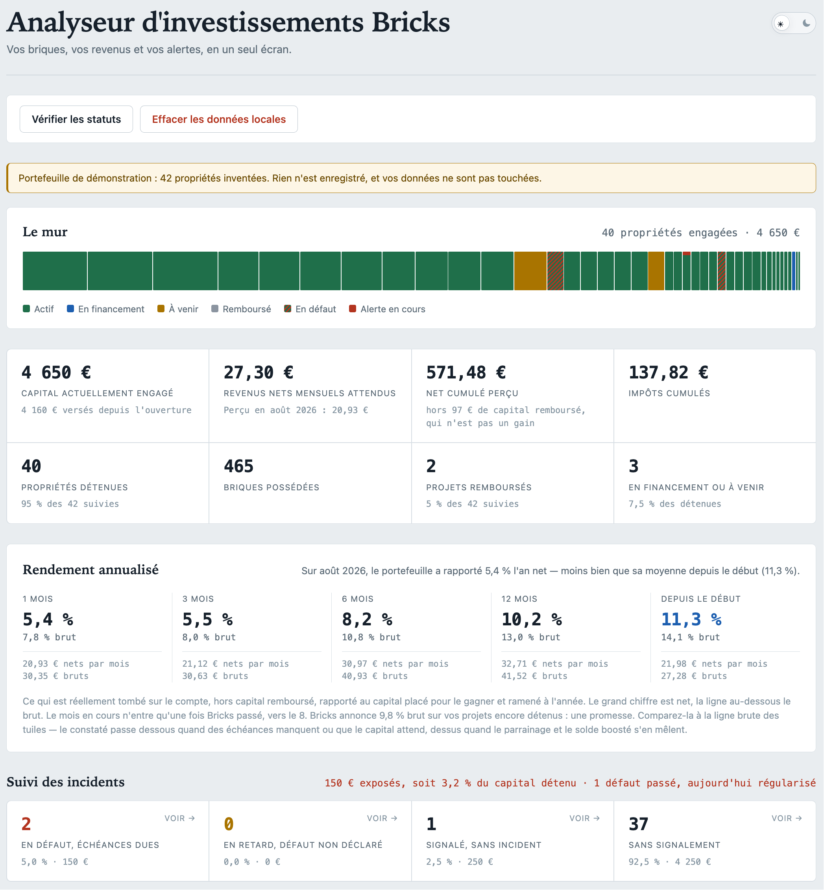
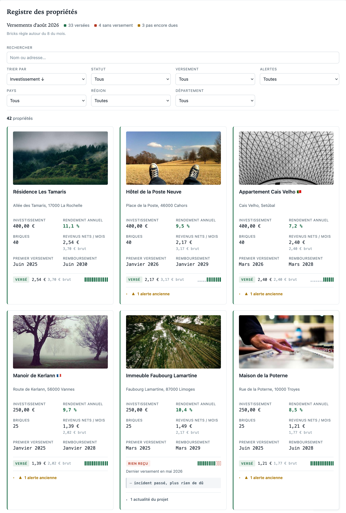
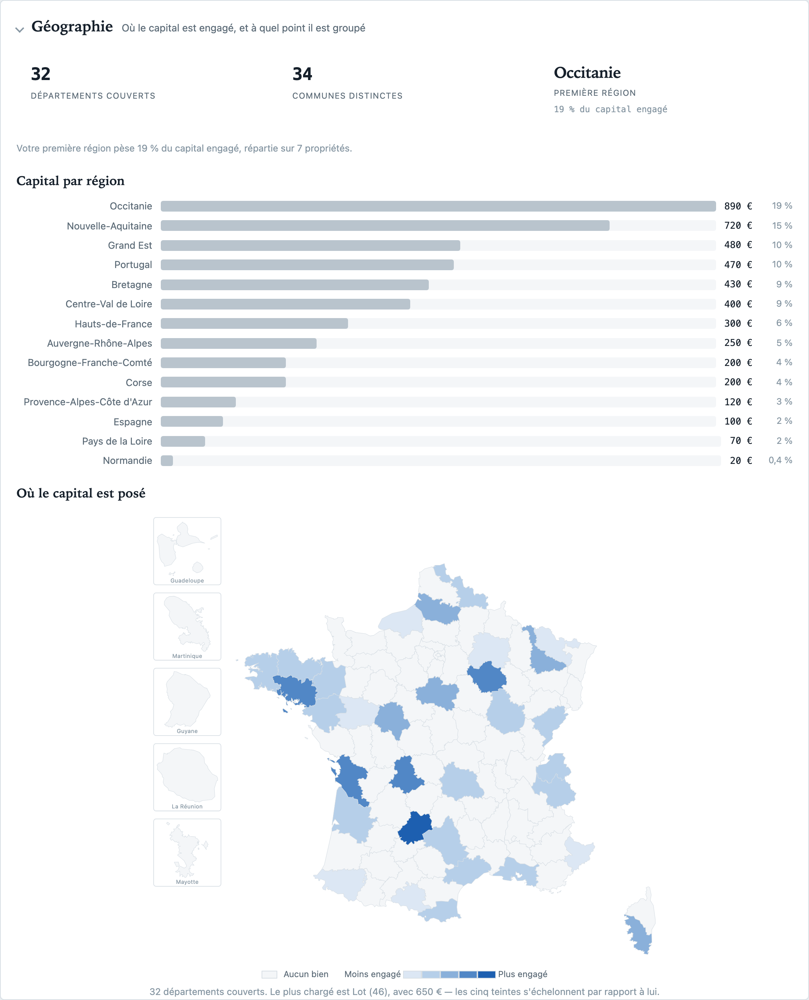

# Analyseur d'investissements Bricks.co

Tableau de bord local pour lire son portefeuille [Bricks.co](https://app.bricks.co) : ce
qui est investi, ce qui a réellement été versé, ce qui manque à l'appel, et ce que ça
donnerait sous d'autres hypothèses. Les données sont récupérées depuis l'API Bricks et ne
quittent pas votre machine.

> Outil indépendant, sans lien avec Bricks.co : ni affilié, ni approuvé, ni soutenu par
> eux. Il lit une API non documentée, qui peut changer sans préavis. Aucun chiffre affiché
> ne fait foi — seul votre relevé Bricks compte — et rien ici n'est un conseil en
> investissement.



## Démarrer

### 1. Lancer l'application

Docker est **obligatoire** : c'est nginx qui relaie les appels vers `api.bricks.co`, que le
navigateur ne peut pas joindre directement ([pourquoi](docs/api.md)).

```bash
docker-compose up -d --build
```

L'application répond sur <http://localhost:8080>. Le `--build` est nécessaire après toute
modification de `nginx.conf` ou d'`index.html`, tous deux copiés dans l'image. `src/` est
monté en direct : le JavaScript et la CSS se rechargent sans reconstruire.

Sans cloner le dépôt, une image prête à l'emploi est publiée à chaque version
([toutes les versions](https://github.com/HermessNRJ/bricks-analyser/releases)) :

```bash
docker run -d -p 8080:80 --name bricks ghcr.io/hermessnrj/bricks-analyser:latest
```

### 2. Récupérer ses données

Trois gestes, et rien à copier :

1. Sur la page d'accueil, **glissez le lien « Collecter mes données Bricks »** dans votre
   barre de favoris.
2. Ouvrez `app.bricks.co`, connectez-vous, puis **cliquez ce favori**. Il lit vos données
   sur place et écrit un fichier `bricks-AAAA-MM-JJ-HHMM.json`.
3. **Déposez ce fichier** sur l'analyseur.

Les données s'affichent et sont conservées dans le localStorage pour les visites suivantes.

**Pourquoi cette gymnastique plutôt qu'un mot de passe.** Le cookie de session de Bricks
donne un accès complet au compte — solde, IBAN, état civil. Il est `HttpOnly` : aucun
script ne peut le lire, y compris celui-ci. Mais depuis une page de `bricks.co`, le
navigateur le joint de lui-même à chaque requête. Le favori s'exécute donc *là-bas*, et
n'a rien à extraire : votre session ne quitte jamais l'onglet qui la détenait, et
l'analyseur ne la voit à aucun moment.

Le code du favori est celui de `src/collecte/extracteur.js`, servi par votre propre machine
au moment où vous posez le lien. Il ne va rien chercher ailleurs à l'exécution, et il ne
joint aucun hôte en dehors de `api.bricks.co` — [un test le vérifie](tests/favori.test.js)
à chaque build.

Le fichier produit, lui, contient votre portefeuille en clair. C'est une donnée, pas une
clé : elle ne donne accès à rien, et elle s'efface.

<details>
<summary>Ou coller le cookie de session, comme avant</summary>

1. Connectez-vous sur `app.bricks.co`.
2. Outils de développement → onglet **Réseau** → cliquez sur une requête vers
   `api.bricks.co` → dans les en-têtes de requête, copiez la valeur de `Cookie`. Elle
   contient `cf_clearance` et `__Secure-better-auth.session_token`, tous deux nécessaires.
3. Collez-la dans le champ prévu. Le préfixe `Cookie:` et les espaces sont tolérés.
4. **Charger les données** (ou Entrée).

La session dure environ 30 jours ; se déconnecter de Bricks l'invalide aussitôt.

> Ce cookie donne un accès complet au compte. Le traiter comme un mot de passe : ne jamais
> le committer ni le coller dans un ticket ou un export HAR partagé. L'application ne le
> persiste jamais. [Détails](docs/securite.md)

Cette voie reste pleinement soutenue. Elle charge tout en une fois, sans passer par un
fichier, et elle est le repli si l'API de Bricks change de forme avant qu'un favori posé
depuis une version ancienne n'ait été reposé.

</details>

### 3. Tenir les données à jour

Le bouton **Vérifier les statuts** interroge le suivi officiel de chaque projet. La date de
récupération est affichée en permanence et signalée au-delà de deux semaines : un filtre
« alerte ce mois-ci » à zéro peut n'être que le reflet de données périmées.

Un nouveau chargement fusionne plutôt qu'il n'écrase : les projets connus sont mis à jour,
les nouveaux ajoutés, et ceux qui ont disparu de l'API vous sont soumis avant suppression.
**Effacer les données locales** remet le tableau de bord à zéro.

## Ce que ça montre

* **Chiffres clés** — investissement, briques et propriétés actives, net perçu et
  impôt prélevé depuis le début, lus sur l'état de compte Bricks.
* **Perçu contre attendu** — ce qui est réellement tombé, face à ce que le portefeuille
  aurait dû verser. L'écart est le manque à gagner. → [Lire les chiffres](docs/revenus.md)
* **Rendement annualisé** — ce que le capital rapporte vraiment, sur 1, 3, 6, 12 mois et
  depuis le début. Un taux constaté, non le taux promis.
* **Carnet de versements** — qui a versé ce mois-ci, qui s'est tu, et depuis quand. Une
  marque par mois sur treize mois, par propriété.
* **Suivi des incidents** — défaut, impayé, contentieux, capital exposé, d'après le statut
  officiel de chaque projet. Cliquer sur une tuile filtre le registre.
* **Revenus par année** — coupons, impôt prélevé, impôt encore dû sur ce qui a été versé
  brut, parrainage, solde boosté, capital remboursé et versements personnels, par année civile.
* **Origine des fonds** — ce que vous avez déposé, ce que le parrainage et le solde boosté
  ont ajouté, et la part du portefeuille qui vient de votre poche.
* **Ce qui ne vous est pas parvenu** — les coupons que les échéances impayées n'ont pas
  versés et les pénalités de retard, cumulés mois par mois. Une échéance rattrapée quitte
  la courbe. → [Lire les chiffres](docs/revenus.md#ce-qui-ne-vous-est-pas-parvenu)
* **Graphiques** — investissement, revenus, arriérés, impôt, répartition des versements,
  portefeuille en surface, avec une période réglable commune aux courbes datées.
* **Géographie** — départements couverts, communes distinctes, capital par région, carte de
  France teintée par département et détail par localisation, filtrable et cliquable pour
  retrouver les biens d'un lieu dans le registre. Déduit du code postal de l'adresse ; ce qui
  n'a pas pu être situé est compté et dit, jamais rangé au hasard.
  → [Lire les chiffres](docs/revenus.md#géographie)
* **Registre des propriétés** — adresse, briques, rendement, alertes datées, fiche
  cliquable vers Bricks. 24, 48, 96 fiches par page ou tout d'un bloc, avec recherche
  libre, tri, et filtres par statut, alerte, pays, région, département et versement,
  rappelés en puces et remisables à zéro.
* **Simulateur** — apport, horizon, rendement, impayés, réinvestissement. Une calculette,
  pas une prévision.
* **Clair ou sombre** — la page suit le réglage du système. L'interrupteur en haut à droite
  le contredit, et s'en souvient d'une visite à l'autre.





## Captures d'écran

Les images de cette page et de [Lire les chiffres](docs/revenus.md) montrent le portefeuille
de démonstration : `npm run demo` fabrique 42 propriétés fictives à photographier, inutile
de publier le vôtre. `npm run serve`, puis `?demo` sur l'adresse locale, l'affiche sans rien
enregistrer. Mode d'emploi, cadrages et emplacements :
[docs/captures](docs/captures/README.md).

## Aller plus loin

| Document | Contenu |
| --- | --- |
| [Lire les chiffres](docs/revenus.md) | Perçu et attendu, carnet de versements, fiscalité, graphiques |
| [Accès à l'API](docs/api.md) | Le proxy nginx, les endpoints, le suivi officiel des projets |
| [Sécurité](docs/securite.md) | Cookie de session, CSP, intégrité des dépendances |
| [Développement](docs/developpement.md) | Tests, pile technique, architecture du code |

## Licence

[GNU AGPL-3.0](LICENSE) — Copyright © 2025-2026 Rémi BOIDET.

Le tracé des départements (`src/carte/departements.svg`) est dérivé d'ADMIN EXPRESS COG de
l'**IGN**, sous [Licence ouverte](https://www.etalab.gouv.fr/licence-ouverte-open-licence/)
(Etalab), via la conversion GeoJSON de Grégoire David. Il est régénéré par
`node tools/carte.mjs`.

Libre d'usage, de modification et de redistribution, à une condition : toute version
modifiée reste sous la même licence, **y compris si elle est seulement mise à disposition
sur un réseau** plutôt que distribuée.

Cette clause n'est pas une formalité ici. La sûreté de l'outil tient à ce qu'il tourne sur
votre machine et que le cookie de session n'aille nulle part ailleurs. Une version hébergée
par un tiers renverse ce modèle : on lui confierait un accès complet à son compte Bricks.
L'AGPL ne l'interdit pas, mais elle oblige qui le ferait à publier son code — donc à rester
vérifiable.

Le programme est fourni sans aucune garantie, dans la mesure permise par la loi.
