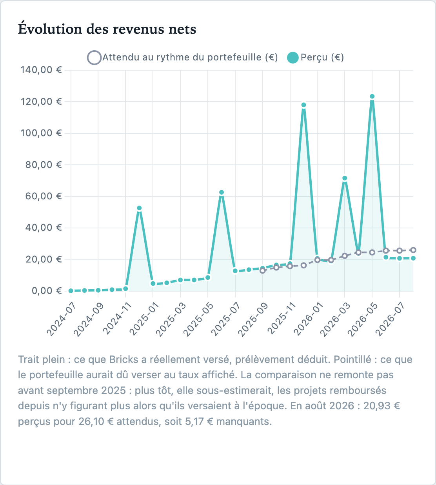
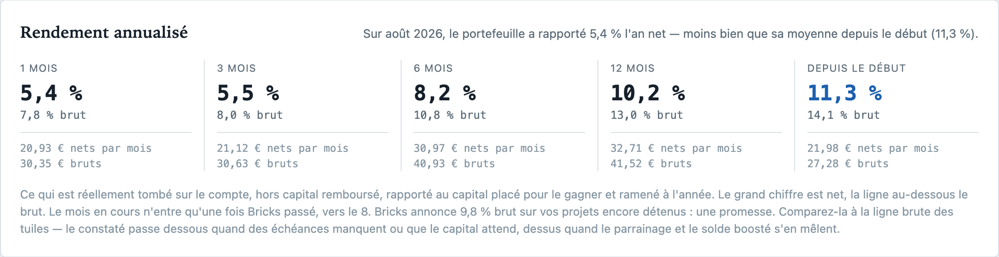
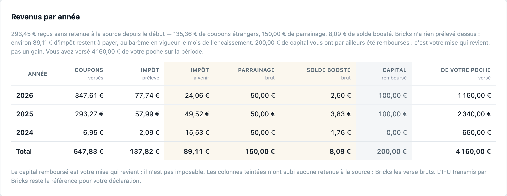
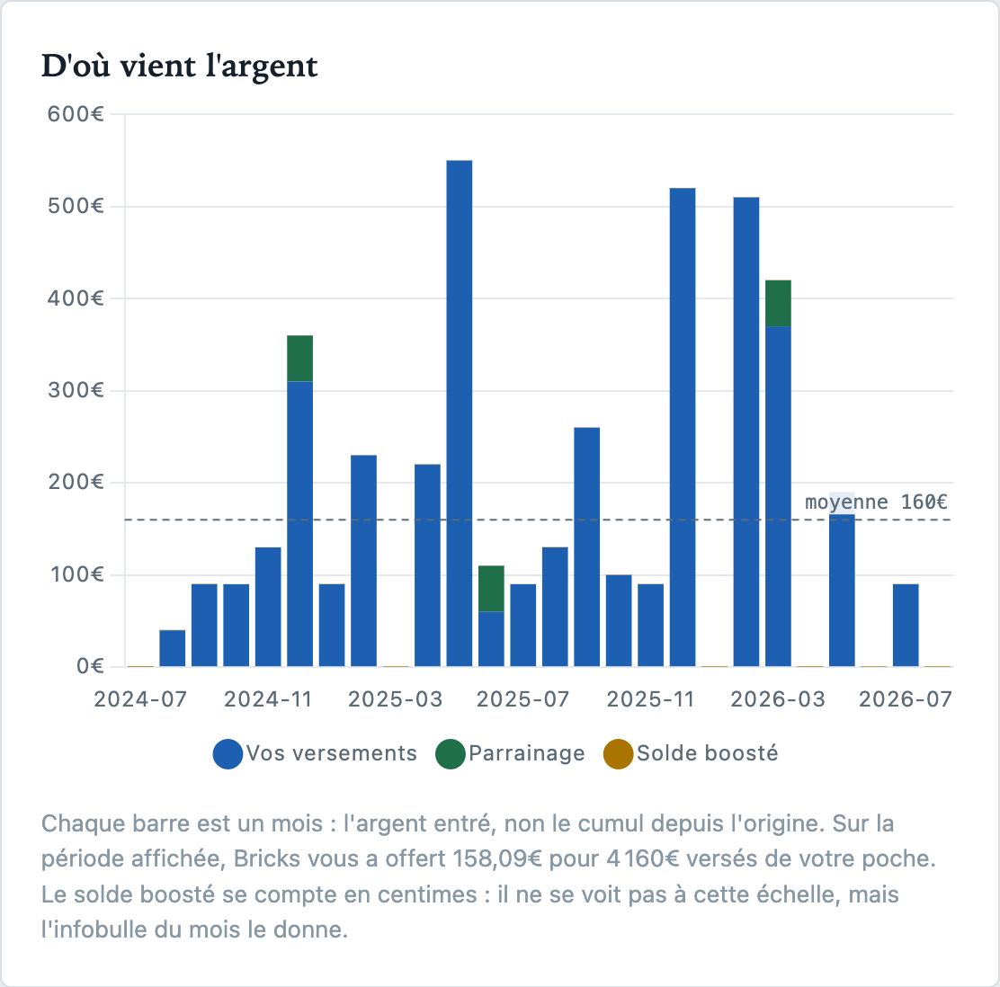
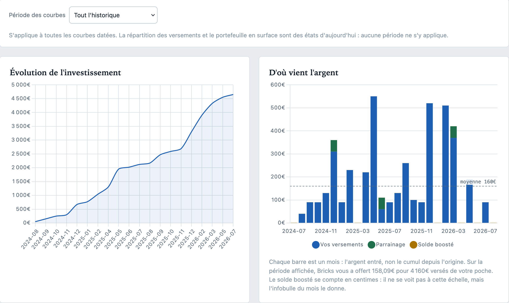
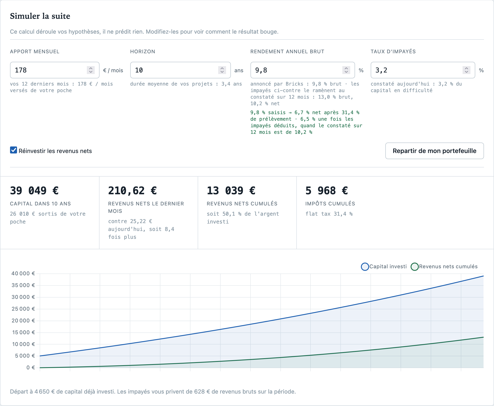

# Lire les chiffres

Le tableau de bord affiche deux natures de chiffres qu'il ne faut pas confondre, et
plusieurs lectures fiscales qui méritent une explication. Tout est ici.

## Attendu et perçu

L'**attendu** se déduit des taux affichés : chaque projet détenu est supposé verser son
coupon. C'est une espérance, utile pour les mois à venir.

Le **perçu** vient de l'état de compte Bricks (`/investor/portfolio/revenue`). Il diffère
de l'attendu pour de bonnes raisons :

* les échéances impayées n'y figurent pas ;
* les projets remboursés y ont laissé leur historique ;
* le parrainage et le solde boosté s'y ajoutent ;
* le prélèvement réellement retenu n'est pas le taux forfaitaire — un remboursement de
  capital glissé dans un coupon n'étant pas imposable.

Faute d'état de compte (cache d'une version antérieure), l'application retombe sur
l'estimation et le dit à l'écran.

## Rendement annualisé

Le taux affiché par Bricks est **promis**, projet par projet. Celui-ci est **constaté** : ce
qui est réellement tombé sur le compte, net de prélèvement et **hors capital remboursé**,
rapporté au capital placé pour le gagner et ramené à l'année.

Cinq fenêtres — 1, 3, 6, 12 mois et depuis le début — parce qu'un chiffre unique ne dit pas
dans quel sens ça va. Un mois seul est bruyant : un parrainage, un remboursement tombé au
bon moment suffisent à le faire bondir. Douze mois lissent tout, y compris une dégradation
récente. C'est leur écart qui informe, et la phrase en tête de section le résume.

Le mois en cours compte **dès qu'il a reçu son règlement**. Le calendrier ne suffit pas :
Bricks verse autour du 8, si bien qu'au 14 août le mois est encaissé, et l'écarter au motif
qu'il n'est pas fini privait les fenêtres de leur donnée la plus fraîche trois semaines
durant. Deux conditions pour le déclarer clos : la date de règlement est passée, et ses
coupons soutiennent la comparaison avec les trois mois précédents — un versement encore en
route se trahit par un montant anormalement bas. Le 2 du mois, il reste écarté, faute de quoi
le rendement de tout le monde plongerait au début de chaque mois.

Une fenêtre plus longue que l'historique disponible n'est pas affichée du tout, plutôt que
calculée sur des mois qu'on n'a pas.

### Le dénominateur

Diviser par l'investissement d'aujourd'hui fausserait toutes les fenêtres sauf la plus
courte : un portefeuille qui a doublé en un an paraîtrait rapporter moitié moins qu'en
vérité, ses revenus anciens étant rapportés à un capital qui n'existait pas encore. Le
capital réellement placé est donc reconstruit mois par mois.

L'évolution de l'investissement n'y suffit pas. Un projet remboursé vaut zéro euro
aujourd'hui, et pèse donc zéro sur toute la série — y compris sur les mois où il était
détenu et versait. Le capital remboursé depuis, lu dans le journal des mouvements, est réinjecté
pour combler ce trou. Sans le journal, les fenêtres longues sont flattées, et l'écran le dit.

Il n'est pas réinjecté tel quel : le capital restant à rendre comprend des projets achetés
bien après le mois qu'on regarde. Rendre 3 520 € à décembre 2023, où le portefeuille pesait
750 €, en faisait un capital de 4 271 € pour 250 € réellement déposés — et le rendement
depuis le début tombait à 3,8 % au lieu de 5,1 %. Faute de savoir dater l'achat de chaque
projet remboursé, la réinjection se fait **au prorata de la taille qu'avait le portefeuille
ce mois-là** : un mois où l'on détenait 7 % de ce qu'on détient aujourd'hui reçoit 7 % du
capital restant à rendre. C'est une approximation, vérifiée contre les versements cumulés —
sur un portefeuille réel, les deux séries se rejoignent à l'euro près en fin de parcours.

### Le numérateur

L'état de compte range les remboursements de capital **avec** les coupons : en juin 2026,
Villa Gypsea y figure pour 34,67 € quand son coupon mensuel vaut 4,33 €. Les prendre pour du
revenu ferait bondir le rendement d'un projet qui vient de rendre la mise.

Ils ne sont **pas** défalqués depuis le journal des mouvements. Essayé, et faux : le journal
compte des remboursements que la ligne de coupons ne contient pas, au point de la vider
entièrement — le rendement tombait à 0,0 % sur un portefeuille qui verse tous les mois.

Le prélèvement, lui, se lit. Bricks retient à la source sur les intérêts français, un
remboursement de capital n'étant pas imposable : **le prélèvement du mois divisé par le
barème de ce mois-là rend ces intérêts-là**. C'est ce qui explique le taux effectif de 25 %
observé sur la ligne de coupons là où le barème est à 31,4 %.

Tout ce qui échappe au prélèvement n'est pas du capital pour autant. Les **projets
étrangers** versent sans retenue à la source — l'impôt est réclamé plus tard, sur la
déclaration — et passeraient sinon pour une mise remboursée. Ils sont identifiés par le pays
de la propriété et rendus au numérateur.

Reste un résidu, imputé au capital faute de mieux. Mesuré sur un portefeuille réel, il se
compose de deux choses : un fond stable d'environ **9 % de chaque coupon**, qui est
l'amortissement mensuel du principal, et des **pointes** sur les mois où un projet solde sa
mise. Il est affiché au survol de chaque fenêtre, pour que personne n'ait à le croire sur
parole.

Deux garde-fous : les intérêts ne peuvent pas dépasser la ligne de coupons, et un mois sans
le moindre prélèvement garde ses coupons entiers, faute de preuve qu'il s'y cache du capital.

Au survol d'une fenêtre : le montant, le capital moyen, la part venue du parrainage et du
solde boosté, le capital remboursé écarté, et le taux avant prélèvement.

### Pourquoi ce taux diffère de celui du simulateur

Le simulateur, plus bas dans la page, affiche « votre moyenne pondérée : X % brut ». C'est la
moyenne des taux **annoncés** par Bricks, pondérée par le capital, sur les seuls projets
encore détenus — une promesse, pas une observation. La ligne en dessous la traduit en net au
barème forfaitaire, puis lui applique la part du capital actuellement en difficulté.

Le taux constaté s'en écarte dans les deux sens. Vers le bas : les échéances non versées, les
mois où le capital attend dans un projet en financement, les projets remboursés qui ne
comptent plus dans la promesse. Vers le haut : le parrainage et le solde boosté, qui ne
viennent d'aucune propriété. La note sous la bande de rendement rappelle les deux chiffres
côte à côte, pour qu'aucun des deux ne passe pour l'autre.

## Bilan des versements

En tête du registre : le mois jugé, et le décompte des propriétés versées, muettes et pas
encore dues.

Bricks règle autour du 8, ce que rappelle la ligne sous le décompte. Sur un relevé récupéré
plus tôt dans le mois, les versements absents sont peut-être encore en route plutôt qu'en
défaut.

## Carnet de versements

Chaque fiche dit ce que le projet a versé sur le dernier mois de l'état de compte :
**Versé** (avec le montant), **Rien reçu** (avec le mois du dernier versement),
**Pas encore** (projet en financement ou premier versement annoncé plus tard), **Soldé**
pour un projet remboursé — le rougir tous les mois suivants noierait les vrais impayés.

Suit une marque par mois sur treize mois, pleine quand l'argent est tombé. C'est le rythme
qui rend le rouge lisible : douze mois pleins suivis d'un blanc ne se lisent pas comme un
silence d'un an. Un mois dû et non versé garde sa case, vide.

Deux règles de prudence :

* Rien ne s'affiche sans état de compte. Une pastille posée sans relevé serait une
  accusation sans pièce au dossier.
* Un projet muet mais sans date de versement annoncée ni versement passé reste en
  **Pas encore** : rien ne prouve qu'un coupon était dû.

Le mois jugé est le dernier du relevé, pas celui de l'horloge — sans quoi un cache de trois
semaines mettrait tout le portefeuille en défaut d'un coup.

## Revenus par année

Ventilation par année civile : coupons versés, impôt prélevé, parrainage et solde
boosté.

Bricks ne prélève **que sur les coupons**. Le parrainage et le solde boosté — ces centimes
crédités jour après jour — arrivent bruts, sans retenue à la source, et restent donc à
déclarer. Vérifié sur tout l'historique : mois après mois, `taxedTotal` vaut exactement
`coupons − prélèvement + parrainage + solde boosté`.

La colonne des coupons mêle intérêts et remboursements de capital, d'où un prélèvement
effectif inférieur au barème (22 % en 2024, 25 % en 2026 pour un barème à 30 puis 31,4 %).
Elle ne vaut donc pas montant imposable : **l'IFU transmis par Bricks reste la référence**.

Le **capital remboursé** a sa propre colonne, lue dans le journal des mouvements
(`/wallet-transactions`). C'est la mise qui revient, pas un gain — et l'état de compte la
range pourtant avec les coupons : en juin 2026, Villa Gypsea y figure pour 34,67 € quand
son coupon mensuel vaut 4,33 €. La colonne reste masquée tant que le journal n'a pas été
lu, une colonne de zéros se lisant à tort comme « aucun remboursement ».

## Impôt à venir

Bricks prélève à la source sur les coupons **français**. Trois recettes y échappent :

* les **coupons étrangers** — un projet portugais ou espagnol verse brut ;
* le **parrainage**, versé brut ;
* le **solde boosté**, ces centimes crédités jour après jour.

Elles ont ceci de traître qu'elles ressemblent à de l'argent déjà net. La colonne *Impôt à
venir* chiffre la note, année par année, au barème en vigueur le mois de l'encaissement.

C'est un ordre de grandeur, pas une déclaration : le taux réel dépend de votre situation, et
un projet étranger peut ouvrir droit à un crédit d'impôt au titre de la convention fiscale du
pays. **L'IFU transmis par Bricks reste la référence.**

La dernière colonne, **de votre poche**, va dans l'autre sens : ce que vous avez versé
depuis votre banque cette année-là, retraits défalqués. Ce n'est pas un revenu et cela ne se
déclare pas — c'est un mouvement de trésorerie, mis là parce que c'est le seul endroit où
les années se comparent. Elle vient du même journal, et se masque de même sans lui.

## D'où vient l'argent

Le registre ne dit pas d'où vient l'argent : une brique achetée par virement et une brique
achetée avec un coupon réinvesti se ressemblent exactement. Trois sources alimentent le
compte, et le graphique les sépare en courbes cumulées — **vos versements** (lus dans le
journal), le **parrainage** et le **solde boosté** (lus dans l'état de compte).

Les trois partagent une échelle, et les versements l'occupent presque toute. C'est
l'information, pas un défaut de cadrage : les cadeaux de la plateforme pèsent quelques
pour cent des apports. Cliquer sur une source dans la légende la masque, et les autres
reprennent alors toute la hauteur.

La tuile **Investissement total** porte la même lecture en un chiffre : *dont X de votre
poche*. Si l'investissement dépasse ce qui a été déposé, la différence ne peut venir que
des gains remis au travail — l'argent n'a pas d'autre porte d'entrée.

## Ce qui ne vous est pas parvenu

Les tuiles d'incident disent combien de projets vont mal ; les fiches disent ce que chacun
vous doit aujourd'hui. Ni les unes ni les autres ne disent depuis **quand**, ni si le trou
se creuse ou se rebouche. Ce graphique cumule les deux dettes, mois par mois.

Elles sont distinctes, et la nuance décide de ce qui reste sur la courbe :

| Statut de l'échéance | Coupon | Pénalité |
| --- | --- | --- |
| `unpaid` — jamais versée | dû | due |
| `pending_penalties` — versée en retard | reçu, sort de la courbe | due |
| `regularized` — rattrapée | reçu, sort de la courbe | recouvrée, **pas encore reversée** |
| `paid` — soldée | rien | rien |

Une pénalité régularisée reste donc affichée. Bricks la range en
`recovered_awaiting_distribution` : l'emprunteur a payé, l'obligataire n'a pas encore reçu,
et le graphique répond à la question « qu'est-ce qui ne m'est pas parvenu », pas « qu'est-ce
qui n'a pas été recouvré ». Vérifié sur les quatre projets en défaut du portefeuille : les
pénalités des échéances impayées reconstituent au centime le `pending_recovery` du résumé,
celles des régularisées le `recovered_awaiting_distribution`.

Comme la série se reconstruit à chaque lecture des statuts, une régularisation ne se
retranche pas : la ligne cesse d'avoir jamais existé, et le cumul du mois où elle tombait
redescend — toute la courbe avec lui.

La **barre verticale** au dernier mois porte la somme des deux courbes. Ses deux segments
reprennent leurs couleurs : le premier s'arrête où finit la courbe des coupons, le second
ajoute les pénalités. Elle se calcule sur les mois **dessinés**, et suit donc la période
choisie.

Les montants sont **bruts** — c'est ce que les projets doivent. La note chiffre ce que le
prélèvement en laisserait sur le compte, projet français par projet français.

Le coupon manqué se déduit du projet au taux annoncé, jamais du montant porté par
l'échéance : celui-ci est la dette de l'emprunteur, échéancier et commission de plateforme
compris. Les pénalités, elles, sont à l'échelle du projet entier et se ramènent au prorata
des briques détenues. Sans le nombre total de briques — que les statuts mis en cache par
une version antérieure ne portent pas — elles sont tues plutôt qu'estimées.

## Les graphiques

* **Évolution de l'investissement** — la croissance du capital engagé au fil du temps.
* **Évolution des revenus nets** — deux courbes. En trait plein, ce qui a réellement été
  encaissé. En pointillé, ce que le portefeuille aurait dû verser au taux affiché ; l'écart
  est le manque à gagner, chiffré au survol et sous le graphique. Le mois en cours,
  forcément incomplet, est tracé avec un point creux.
* **Impôt mensuel prélevé** — le prélèvement effectivement retenu par Bricks. À défaut
  d'état de compte, l'estimation au taux en vigueur (30 % jusqu'en décembre 2025, 31,4 %
  ensuite, chaque mois au taux de son époque).
* **Ce qui ne vous est pas parvenu** — [les deux dettes cumulées](#ce-qui-ne-vous-est-pas-parvenu)
  des projets en retard, coupons manqués et pénalités, et la barre de leur somme.
* **Répartition des versements** — camembert des quatre états du carnet : à jour, démarrage
  en attente, en retard, déjà remboursé. Les quatre forment une partition des propriétés
  détenues — chacune en occupe un et un seul — et l'effectif au centre suit les tranches
  cochées. « Déjà remboursé » commence décoché : sur un portefeuille ancien, les projets
  soldés écrasent les trois états sur lesquels on a prise. Un clic sur la légende les
  rappelle.
* **Portefeuille en surface** — treemap des propriétés actives, taille proportionnelle à
  l'investissement, couleur selon le rendement.
* **Le mur** — une brique par propriété, largeur proportionnelle à l'investissement.
  Cliquer sur une brique amène à sa fiche.

### Pourquoi la comparaison s'arrête à douze mois

L'attendu se calcule sur les projets **encore détenus**. Plus on remonte, plus il
sous-estime : les projets remboursés depuis n'y figurent plus alors qu'ils versaient à
l'époque. En décembre 2024, il annonçait 13,59 € contre 36,41 € réellement perçus — la
comparaison se lirait à l'envers de la vérité. Au-delà de la fenêtre, la courbe pointillée
s'arrête plutôt que de mentir.

### Parcourir le registre

Les onglets sous la grille portent la **plage de fiches** qu'ils ouvrent — `1–24`, `25–48` —
et non un numéro de page. Le registre est trié, par investissement, par nom, par rendement :
« 3 » ne dit rien de ce qu'on y trouvera, quand `49–72` situe d'emblée dans l'ordre choisi.
Au-delà de neuf pages, seules la première, la dernière et les voisines de la courante
restent affichées.

Le sélecteur au bout de la ligne règle le nombre de fiches par page : 24, 48, 96 ou tout
d'un bloc. Le choix est retenu d'une visite à l'autre. « Tout » sur 241 propriétés donne
une page de 56 000 px, rendue en une centaine de millisecondes — long à faire défiler, mais
c'est le seul réglage qui permette de chercher à l'œil ou d'imprimer.

Changer la taille ramène à la première page : rester à la page 5 après être passé de 24 à
96 fiches sauterait par-dessus les trois quarts de la liste sans qu'on l'ait demandé.

### Période des courbes

Un réglage unique gouverne tous les graphiques datés — investissement, origine des fonds,
revenus, arriérés, impôt. Raccourcis (3, 6, 12, 24 derniers mois, tout l'historique) ou
mois de début et de fin au choix.

Un sélecteur par graphique aurait laissé les lire sur des fenêtres différentes, ce qui rend
la comparaison trompeuse. Les bornes se calculent sur une référence commune, arrêtée au
mois courant : sans cela, « les trois derniers mois » auraient désigné une fenêtre
entièrement future pour la série estimée, qui se prolonge de trois mois.

La répartition des versements et le portefeuille en surface sont des états d'aujourd'hui :
aucun axe temporel, donc aucune période à leur appliquer.

## Géographie

Repliée par défaut, et dessinée seulement au premier dépliage : le tableau fait une ligne
par commune, et sur 241 biens il s'en compose une centaine qu'on ne regarde pas à chaque
visite. La question à laquelle elle répond n'est pas « où sont mes biens » — le registre le
dit déjà, fiche par fiche — mais **à quel point ils sont au même endroit**.

Département et région sont déduits du **code postal** contenu dans l'adresse publiée par
Bricks, dernier groupe de cinq chiffres de la chaîne. Les projets remboursés en sont
exclus : ils ne portent plus de capital, et les compter annoncerait une présence là où il
n'y a plus rien d'engagé. Les biens à l'étranger sont rangés sous leur pays, qui tient lieu
de région.

Ce que la déduction vaut : un code postal désigne une zone de distribution postale, pas une
commune. Il suffit pour le département ; il ne suffirait pas pour poser un point sur une
carte. La Corse n'ayant pas de département 20, les codes sont coupés à 20190 entre 2A et
2B — la convention usuelle, qui se trompe sur quelques communes limitrophes.

Ce qu'elle ne devine pas, elle le dit. Une adresse sans code postal exploitable n'est pas
interprétée d'après son texte : elle est comptée, rangée sous « Localisation imprécise », et
le nombre est annoncé sous les compteurs. Une région déduite d'un nom de lieu serait
invérifiable, et un portefeuille dont un dixième des biens échappe au classement doit le
montrer plutôt que de le fondre dans « Autre ».

Aucun seuil de concentration n'est affiché : dire « concentration élevée » au-delà d'un
chiffre choisi ici serait un jugement que rien dans les données ne fonde. La part de la
première région est donnée, la lecture appartient au lecteur.

Le champ **Filtrer** au-dessus du tableau tamise les lignes sur les colonnes de texte —
commune, code et nom de département, région. Pas sur les montants : chercher dans les
chiffres ferait répondre « 250 » à qui tape un code de département, et la colonne Capital
les trie déjà. Le décompte rappelle alors le total, faute de quoi on ne saurait pas si la
recherche a écarté trois lignes ou quatre-vingts.

**Cliquer une ligne** ne garde que ses biens dans le registre, comme cliquer une tuile
d'incident : un chiffre agrégé doit pouvoir être vérifié sur pièces, et la pièce est ici la
fiche de chaque bien. Le filtre est rappelé en puce — « Cahors (46) » — et se retire comme
les autres. La clé qui identifie le lieu est la même des deux côtés, si bien que la ligne et
le registre comptent forcément les mêmes biens ; deux communes homonymes de départements
différents restent distinctes.

Les menus **Région** et **Département** du registre ne listent que ce que le portefeuille
contient. Un réglage retenu d'une visite précédente qui ne correspond plus à rien est
rouvert d'office : sans cela, un portefeuille dont le dernier bien breton vient d'être
remboursé afficherait un registre vide sans que le menu ne montre pourquoi. Le filtre de
localisation, qui n'a pas de menu, est vérifié de la même façon.

## Suivi des incidents

Répartition des propriétés détenues entre défaut avec échéances dues, impayé, suivi à jour
et sans signalement, avec le capital exposé. Cliquer sur une tuile filtre le registre sur
les fiches concernées.

Les niveaux proviennent du [suivi officiel de chaque projet](api.md#suivi-officiel-des-projets),
qui porte le statut déclaré et le décompte des échéances impayées. À défaut, ils retombent
sur une lecture du texte des alertes, nettement moins fiable.

## Projections

Les revenus mensuels nets estimés sont affichés jusqu'au dernier mois où le montant change
réellement. Au-delà, aucun projet ne commence à verser : répéter trois fois le même montant
n'apprendrait rien, et la note dit à partir de quand il est stable.

## Simulateur

Déroule mois par mois vos hypothèses d'apport, d'horizon, de rendement et d'impayés, avec
ou sans réinvestissement. Les valeurs de départ sont celles de votre propre portefeuille.
C'est une calculette, pas une prévision.
